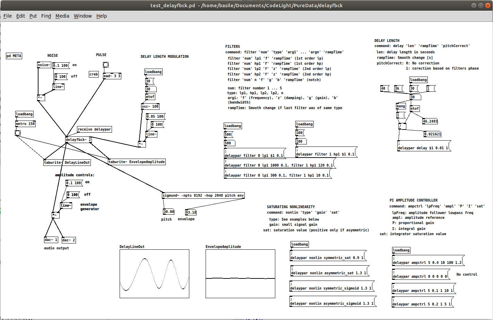

# DelayFbck
## Delay line with feedback

`delayfbck`is an external written in C for the music patcher program [Pure Data](https://puredata.info/). It's purpose is to experiment with basic [physical modelling synthesis](https://ccrma.stanford.edu/~jos/pasp/), a maybe somewhat dated way of creating sound, but definitelly a fun one to fiddle with. The code is in a working state but certainly needs some further improvements and testing. 

For now, `delayfbck` includes:

1. Delay line with linearly interpolated tap
2. Feedback with saturations and settable filters
3. Envelope detector: A rectifier and lowpass allows to measure the resonance amplitude
4. Amplitude controller: The feeback gain can be continuousely adjusted by a proportional-integral controller. This allows to stabilize the resonnance without necessarily hitting too hard in the saturation 
5. Pitch correction: the delay length can be corrected by taking the filters phase at the expected resonance frequency into account. This allows to create the really intended pitch. Works well on high pitches, not so well on lower pitches for some reasons.
6. Plucked string: Pluck the delay line à la [Karplus-Strong]() with a triangular "string" shape.

Sound sample at [https://youtu.be/t_nbeB5ekew](https://youtu.be/t_nbeB5ekew )

To learn how to write PD externals, check [https://github.com/pure-data/externals-howto](https://github.com/pure-data/externals-howto)

To help you build (compile) externals, check [https://github.com/pure-data/pd-lib-builder](https://github.com/pure-data/pd-lib-builder)

